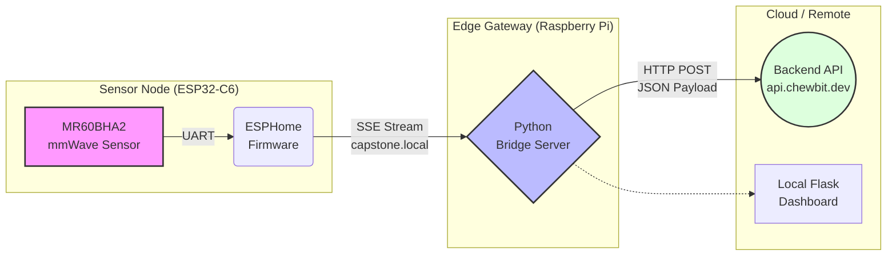

# 하트뷰(Heartview): 실시간 생체 신호 모니터링 시스템 (Hardware & Edge Gateway)


하트뷰(Heartview)는 비접촉식 mmWave(밀리미터파) 레이더 센서를 활용하여 사용자의 심박수(BPM), 호흡수(RPM), 재실 여부(Presence)를 실시간으로 측정하고, Edge Gateway(라즈베리파이)를 거쳐 클라우드 서버로 데이터를 전송하는 스마트 헬스케어 IoT 시스템입니다.

---

## 시스템 아키텍처 (System Architecture)

본 프로젝트는 센서 노드(ESP32)와 엣지 게이트웨이(Raspberry Pi), 그리고 백엔드 API 간의 유기적인 데이터 파이프라인을 구축했습니다.



## 하드웨어 구성 (Hardware Spec)

<table>
  <thead>
    <tr>
      <th>구분</th>
      <th>모델명</th>
      <th>역할</th>
    </tr>
  </thead>
  <tbody>
    <tr>
      <td><b>MCU</b></td>
      <td>Seeed Studio XIAO ESP32-C6</td>
      <td>Wi-Fi 6 지원 초소형 칩셋, 센서 제어 및 데이터 송신</td>
    </tr>
    <tr>
      <td><b>센서</b></td>
      <td>Seeed MR60BHA2</td>
      <td>60GHz mmWave 레이더, 비접촉 심박 및 호흡 측정</td>
    </tr>
    <tr>
      <td><b>게이트웨이</b></td>
      <td>Raspberry Pi 4B</td>
      <td>엣지 노드, 실시간 데이터 수신 및 백엔드 API 포워딩</td>
    </tr>
  </tbody>
</table>

## 사용 및 설치 방법 (Installation Guide)

1. 공통 환경 설정
     프로젝트 최상위 폴더의 config.env 파일을 수정하여 와이파이 정보를 설정합니다.
```bash
WIFI_SSID="와이파이_이름"
WIFI_PASSWORD="와이파이_비밀번호"
```

2. 윈도우 환경 세팅 (센서 초기 설정)
       센서를 PC에 연결한 후 setup_win.bat 파일을 실행합니다. 이 단계에서는 하드웨어 펌웨어 업로드와 초기 통신 테스트가 자동으로 진행됩니다.
```bash
# setup_win.bat 실행 시 수행 내용
1. 필수 파이썬 패키지 자동 설치
2. heartrate.yaml 파일 내 와이파이 정보 자동 주입
3. ESP32-C6 센서로 펌웨어 업로드 및 실행
```
3. 라즈베리파이 가동 (실제 서비스 배포)
       설치 장소에 라즈베리파이를 배치한 후 아래 명령어를 실행합니다. 시스템이 백그라운드에서 24시간 가동됩니다.
```bash
# 실행 권한 부여 및 시스템 가동
chmod +x setup_pi.sh
bash setup_pi.sh

# 가동 후 데이터 전송 상태는 아래 명령어로 실시간 확인이 가능합니다.
tail -f bridge.log
```
